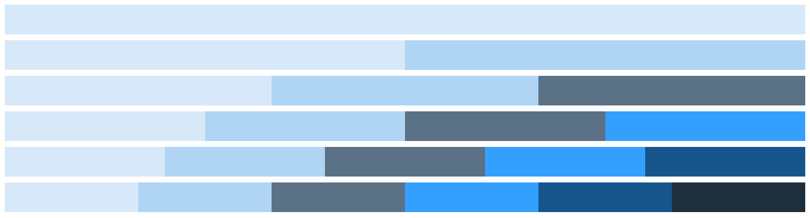

## 1- Simple Grids

Grid Block is using a 6 columns system.

 The `gc-x` mean a grid container with x columns : `gc-1 , gc-2 , gc-3 , gc-4 , gc-5 , gc-6` 

**Screen shot**



**Code**

```html
<div class="gc-1">
   <div class="item"></div>
</div>
<div class="gc-2">
   <div class="item"></div>
   <div class="item"></div>
</div>
<div class="gc-3">
   <div class="item"></div>
   <div class="item"></div>
   <div class="item"></div>
</div>
<div class="gc-4">
    <div class="item"></div>
    <div class="item"></div>
    <div class="item"></div>
    <div class="item"></div>
</div>
<div class="gc-5">
    <div class="item"></div>
    <div class="item"></div>
    <div class="item"></div>
    <div class="item"></div>
    <div class="item"></div>
</div>
<div class="gc-6">
    <div class="item"></div>
    <div class="item"></div>
    <div class="item"></div>
    <div class="item"></div>
    <div class="item"></div>
    <div class="item"></div>
</div>
```


## 2- Simple Grid with Gaps

You can easily add gaps to the grid container using the `gap-5 , gap-10 or gap-15` class, and you can create your own class if you want a different gap size.

```css
.gap-2{
  grid-gap: 2px 2px;
}
//or
.gap-2-4{
  grid-gap: 2px 4px;
}
```

**Screen Shot**


**Code**

```html
<div class="gc-1 gap-10">
   <div class="item"></div>
</div>
<div class="gc-2 gap-10">
   <div class="item"></div>
   <div class="item"></div>
</div>
<div class="gc-3 gap-10">
   <div class="item"></div>
   <div class="item"></div>
   <div class="item"></div>
</div>
<div class="gc-4 gap-10">
    <div class="item"></div>
    <div class="item"></div>
    <div class="item"></div>
    <div class="item"></div>
</div>
<div class="gc-5 gap-10">
    <div class="item"></div>
    <div class="item"></div>
    <div class="item"></div>
    <div class="item"></div>
    <div class="item"></div>
</div>
<div class="gc-6 gap-10">
    <div class="item"></div>
    <div class="item"></div>
    <div class="item"></div>
    <div class="item"></div>
    <div class="item"></div>
    <div class="item"></div>
</div>
```


## 3- Simple Responsive Grid

Adding  the `resp` class make the grid container responsive for all screen sizes.

**Screen Shot**


**Code**

```html
<div class="gc-4 gap-10 resp">
    <div class="item"></div>
    <div class="item"></div>
    <div class="item"></div>
    <div class="item"></div>
</div>
```

q
