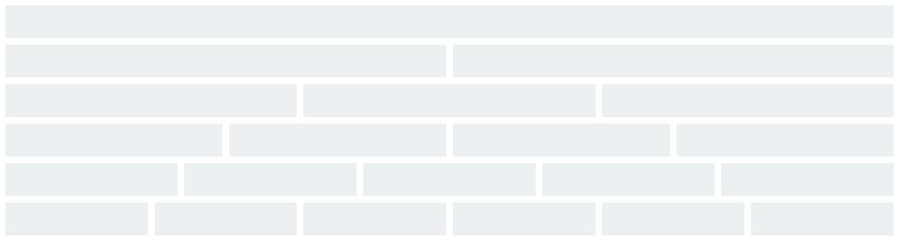

[TOC]


## 1- Simple Grids :

Block Grid is using a 6 columns system.

 The `gc-x` mean a grid container with x columns : `gc-1 , gc-2 , gc-3 , gc-4 , gc-5 , gc-6` 

**Screen shot**


**Code**

```html
<div class="gc-1">
   <div class="item"></div>
</div>
<div class="gc-2">
   <div class="item"></div>
   <div class="item"></div>
</div>
<div class="gc-3">
   <div class="item"></div>
   <div class="item"></div>
   <div class="item"></div>
</div>
<div class="gc-4">
    <div class="item"></div>
    <div class="item"></div>
    <div class="item"></div>
    <div class="item"></div>
</div>
<div class="gc-5">
    <div class="item"></div>
    <div class="item"></div>
    <div class="item"></div>
    <div class="item"></div>
    <div class="item"></div>
</div>
<div class="gc-6">
    <div class="item"></div>
    <div class="item"></div>
    <div class="item"></div>
    <div class="item"></div>
    <div class="item"></div>
    <div class="item"></div>
</div>
```


## 2- Simple Grid with Gaps :

You can easily add gaps to the grid container using the `gap-5 , gap-10 or gap-15` class, and you can create your own class if you want a different gap size.

```css
.gap-2{
  grid-gap: 2px 2px;
}
//or
.gap-2-4{
  grid-gap: 2px 4px;
}
```

**Screen Shot**



**Code**

```html
<div class="gc-1 gap-10">
   <div class="item"></div>
</div>
<div class="gc-2 gap-10">
   <div class="item"></div>
   <div class="item"></div>
</div>
<div class="gc-3 gap-10">
   <div class="item"></div>
   <div class="item"></div>
   <div class="item"></div>
</div>
<div class="gc-4 gap-10">
    <div class="item"></div>
    <div class="item"></div>
    <div class="item"></div>
    <div class="item"></div>
</div>
<div class="gc-5 gap-10">
    <div class="item"></div>
    <div class="item"></div>
    <div class="item"></div>
    <div class="item"></div>
    <div class="item"></div>
</div>
<div class="gc-6 gap-10">
    <div class="item"></div>
    <div class="item"></div>
    <div class="item"></div>
    <div class="item"></div>
    <div class="item"></div>
    <div class="item"></div>
</div>
```


## 3- Simple Responsive Grid :

Adding  the `resp` class make the grid container responsive for all screen sizes.

**Screen Shot**


**Code**

```html
<div class="gc-4 gap-10 resp">
    <div class="item"></div>
    <div class="item"></div>
    <div class="item"></div>
    <div class="item"></div>
</div>
```


## 4- Grid with positioned Column :

You can change the position of the item to the Column **X**  by adding :

` pos-c-1 , pos-c-2 , pos-c-3 , pos-c-4 , pos-c-5 , pos-c-6 ` 

**Screen Shot **


**Code**

```html
	 // Column 5 and 8 to the second column position
    <div class="gc-4 gap-10 resp">
        <div class="item">1</div>
        <div class="item">2</div>
        <div class="item">3</div>
        <div class="item">4</div>
        <div class="item pos-c-2">5</div>
        <div class="item">6</div>
        <div class="item">7</div>
        <div class="item pos-c-2">8</div>
        <div class="item">9</div>
        <div class="item">10</div>
    </div>
```


## 5- Grid with positioned Column + Dense Class:

qsdzdqsd

**Screen Shot **


**Code**

```html
	 // Column 5 and 8 to the second column position
    <div class="gc-4 gap-10 resp dense">
        <div class="item">1</div>
        <div class="item">2</div>
        <div class="item">3</div>
        <div class="item">4</div>
        <div class="item pos-c-2">5</div>
        <div class="item">6</div>
        <div class="item">7</div>
        <div class="item pos-c-2">8</div>
        <div class="item">9</div>
        <div class="item">10</div>
    </div>
```


## 6- Grid with positioned Row:

You can change the position of the item to the Row **Y**  by adding :

` pos-r-1 , pos-r-2 , pos-r-3 , pos-r-4 , pos-r-5 , pos-r-6 `  

**Screen Shot **


**Code**

```html
	// column 8 to the first row position
    <div class="gc-5 gap-10 resp">
        <div class="item ">1</div>
        <div class="item">2</div>
        <div class="item">3</div>
        <div class="item">4</div>
        <div class="item">5</div>
      	<div class="item">6</div>
      	<div class="item">7</div>
      	<div class="item pos-r-1">8</div>
      	<div class="item">9</div>
      	<div class="item">10</div>
      	<div class="item">11</div>
      	<div class="item">12</div>
      	<div class="item">13</div>
      	<div class="item">14</div>
      	<div class="item">15</div>
    </div>
```


## 7- Grid with positioned Column and Row:

You can change the position of the item to the column **X**  and to the Row **Y**  by adding both positions class.

**Screen Shot **


**Code**

```html
	// column 8 to the first row in the fourth column position
    <div class="gc-5 gap-10 resp">
        <div class="item ">1</div>
        <div class="item">2</div>
        <div class="item">3</div>
        <div class="item">4</div>
        <div class="item">5</div>
      	<div class="item">6</div>
      	<div class="item">7</div>
      	<div class="item pos-r-1 pos-c-4">8</div>
      	<div class="item">9</div>
      	<div class="item">10</div>
      	<div class="item">11</div>
      	<div class="item">12</div>
      	<div class="item">13</div>
      	<div class="item">14</div>
      	<div class="item">15</div>
</div>
```


## 8- Grid with resized Column :

You can change the size of the column by adding :

` col-1-3 ... col-1-7`  ` col-2-4 ... col-2-7`  ` col-3-5 ... col-3-7` ` col-4-6 ... col-4-7` and  ` col-5-7` 

**Screen Shot 1**


**Code**

```html
<div class="gc-4 gap-10 resp">
    <div class="item col-1-3"></div>
    <div class="item"></div>
    <div class="item"></div>
</div>
```

**Screen Shot 2**


**Code**

```html

 <div class="gc-5 gap-10 resp">
      <div class="item">1</div>
      <div class="item">2</div>
      <div class="item col-3-5">3</div>
      <div class="item">4</div>
      <div class="item">5</div>
</div>
```


## 9- Grid with resized Row :

You can change the size of the row by adding :

` row-1-3 ... row-1-7`  ` row-2-4 ... row-2-7`  ` row-3-5 ... row-3-7` ` row-4-6 ... row-4-7` and  ` row-5-7` 

By default the item will be located at the first column. "Read the Part n°= 9"

**Screen Shot 1**


**Code**

```html
<div class="gc-3 gap-10 resp">
    <div class="item ">1</div>
    <div class="item">2</div>
    <div class="item">3</div>
  	<div class="item row-1-5">4</div>
  	<div class="item">5</div>
  	<div class="item">6</div>
  	<div class="item">7</div>
  	<div class="item">8</div>
  	<div class="item">9</div>
</div>
```


## 10- Grid with Row + Position :

You can change the position of the resized row item by adding one of the Column position classes :

` pos-c-1 , pos-c-2 , pos-c-3 , pos-c-4 , pos-c-5 , pos-c-6 ` 

**Screen Shot **


**Code**

```html
// column 4 take 4 rows at the third column position
<div class="gc-3 gap-10 resp">
    <div class="item ">1</div>
    <div class="item">2</div>
    <div class="item">3</div>
  	<div class="item row-1-5 pos-c-3">4</div>
  	<div class="item">5</div>
  	<div class="item">6</div>
  	<div class="item">7</div>
  	<div class="item">8</div>
  	<div class="item">9</div>
</div>
```


## 11- Grid with resized Column and Row :

You can change the size and the position of the item by adding both resizing class "Column and Rows".

No need to add the position class to change the item's position.

**Screen Shot 1**


**Code**

```html
// the column 5 take 2 columns and 2 rows at the first column
<div class="gc-3 gap-10 resp">
    <div class="item ">1</div>
    <div class="item">2</div>
    <div class="item">3</div>
  	<div class="item">4</div>
  	<div class="item col-1-3 row-1-3">5</div>
  	<div class="item">6</div>
  	<div class="item">7</div>
  	<div class="item">8</div>
  	<div class="item">9</div>
</div>
```

**Screen Shot 2**


**Code**

```html
// the column 5 take 2 columns and 2 rows at the second column
<div class="gc-3 gap-10 resp">
    <div class="item ">1</div>
    <div class="item">2</div>
    <div class="item">3</div>
  	<div class="item">4</div>
  	<div class="item col-2-4 row-1-3">5</div>
  	<div class="item">6</div>
  	<div class="item">7</div>
  	<div class="item">8</div>
  	<div class="item">9</div>
</div>
```

